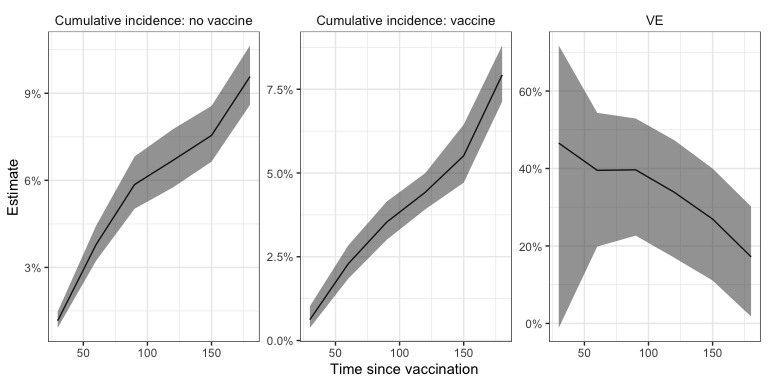
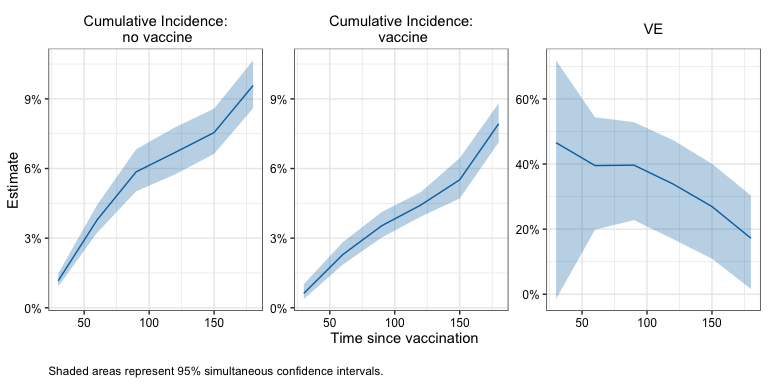

<!-- README.md is generated from README.Rmd. Please edit that file -->

# R/`nomatchVE`

> Estimate vaccine effectiveness in observational studies: a matching
> alternative

<!-- badges: start -->

<!-- badges: end -->

## Description

The `nomatchVE` package uses a G-computation style estimator to compute
vaccine efficacy from observational vaccine studies. The proposed
estimator tends to produce similar point estimates as matching-based
estimators but is more efficient.

## Installation

You can install the development version of `nomatchVE` like so:

``` r
# TODO: not yet available on Github 
# install.packages("devtools")
devtools::install_github("ewu16/nomatchVE")
```

## Example

This minimal example shows how to use `nomatchVE` to obtain cumulative
incidence and vaccine effectiveness estimates in a simple simulated data
set.

``` r
library(nomatchVE)
# Set seed for reproducibility 
set.seed(1234)

# ------------------------------------------------------------------------------
# Example data
head(simdata)
#>   ID x1 x2 V D_obs   Y event
#> 1  1  1  7 1     2  92     0
#> 2  2  0  7 0    NA 210     0
#> 3  3  0 11 1    35 210     0
#> 4  4  0 10 1     6 210     0
#> 5  5  1 11 0    NA 210     0
#> 6  6  1  7 0    NA  90     0
summary(simdata)
#>        ID              x1               x2               V         
#>  Min.   :    1   Min.   :0.0000   Min.   : 5.000   Min.   :0.0000  
#>  1st Qu.: 2501   1st Qu.:0.0000   1st Qu.: 6.000   1st Qu.:0.0000  
#>  Median : 5000   Median :0.0000   Median : 8.000   Median :0.0000  
#>  Mean   : 5000   Mean   :0.4989   Mean   : 8.023   Mean   :0.4112  
#>  3rd Qu.: 7500   3rd Qu.:1.0000   3rd Qu.:10.000   3rd Qu.:1.0000  
#>  Max.   :10000   Max.   :1.0000   Max.   :11.000   Max.   :1.0000  
#>                                                                    
#>      D_obs              Y           event       
#>  Min.   :  1.00   Min.   :  1   Min.   :0.0000  
#>  1st Qu.: 11.00   1st Qu.:174   1st Qu.:0.0000  
#>  Median : 18.00   Median :210   Median :0.0000  
#>  Mean   : 25.78   Mean   :178   Mean   :0.1007  
#>  3rd Qu.: 32.00   3rd Qu.:210   3rd Qu.:0.0000  
#>  Max.   :206.00   Max.   :210   Max.   :1.0000  
#>  NA's   :5888

# ------------------------------------------------------------------------------
# 1. Set input parameters
outcome_name <- "Y"
event_name <- "event"
trt_name <- "V"
time_name <- "D_obs"
adjust_vars <- c("x1", "x2")

times <- seq(30, 180, by = 30)
censor_time <- max(times)
tau <- 14
ci_type <- "wald"
n_boot <- 10
alpha <- .05

# ------------------------------------------------------------------------------
# 2. Compute VE estimand at time points 

fit1 <- nomatchVE(data = simdata,
              outcome_name = outcome_name,
              event_name = event_name,
              trt_name = trt_name,
              time_name = time_name, 
              adjust_vars = adjust_vars,
              times = times,
              censor_time = censor_time, 
              tau = tau,
              ci_type = ci_type,
              n_boot = n_boot, 
              alpha = alpha)
#> Bootstrapping...
#> Time difference of 1.170502 secs
             
fit1$estimates
#> $risk_0
#>       estimate  wald_lower wald_upper    wald_sd wald_n     boot_sd
#> 30  0.01163891 0.009421632 0.01437044 0.10897478     10 0.001223885
#> 60  0.03790915 0.032977413 0.04354521 0.07371694     10 0.002621353
#> 90  0.05857293 0.051107595 0.06705168 0.07359223     10 0.004046512
#> 120 0.06691947 0.058551925 0.07638578 0.07270729     10 0.004563564
#> 150 0.07548793 0.067354759 0.08451420 0.06263278     10 0.004406041
#> 180 0.09576440 0.087057130 0.10524216 0.05352640     10 0.004684788
#> 
#> $risk_1
#>        estimate wald_lower  wald_upper    wald_sd wald_n     boot_sd
#> 30  0.006219935 0.00419231 0.009219148 0.20232299     10 0.001340445
#> 60  0.022925618 0.01939429 0.027082177 0.08718734     10 0.002060689
#> 90  0.035346676 0.03121058 0.040008256 0.06567753     10 0.002292971
#> 120 0.044244807 0.04022530 0.048645599 0.05073486     10 0.002232851
#> 150 0.055146409 0.04860045 0.062516101 0.06799253     10 0.003623622
#> 180 0.079293545 0.07283785 0.086268172 0.04689277     10 0.003508187
#> 
#> $ve
#>      estimate wald_lower wald_upper    wald_sd wald_n    boot_sd
#> 30  0.4655914 0.09017978  0.6861000 0.27147761     10 0.16959167
#> 60  0.3952484 0.23590116  0.5213649 0.11932839     10 0.07678447
#> 90  0.3965357 0.25939031  0.5082846 0.10448500     10 0.06355249
#> 120 0.3388351 0.20113506  0.4527998 0.09652655     10 0.06539091
#> 150 0.2694672 0.13871445  0.3803702 0.08400764     10 0.06150869
#> 180 0.1719935 0.04444629  0.2825158 0.07309828     10 0.06043334

#Plot pointwise intervals 
plot_ve_panel(fit1 , ci_type = "wald") 
```



``` r

#Compute simultaneous CI
simul_ci <- simultaneous_ci(fit1, alpha, seed = 1234)
simul_ci$estimates
#> $risk_0
#>       estimate simul_lower simul_upper simul_n
#> 30  0.01163891 0.009154859  0.01478692      10
#> 60  0.03790915 0.032357671  0.04436940      10
#> 90  0.05857293 0.050166391  0.06828691      10
#> 120 0.06691947 0.057494687  0.07776174      10
#> 150 0.07548793 0.066315508  0.08581243      10
#> 180 0.09576440 0.085931940  0.10659071      10
#> 
#> $risk_1
#>        estimate simul_lower simul_upper simul_n
#> 30  0.006219935  0.00376434  0.01026089      10
#> 60  0.022925618  0.01852783  0.02833712      10
#> 90  0.035346676  0.03016674  0.04137811      10
#> 120 0.044244807  0.03919162  0.04991567      10
#> 150 0.055146409  0.04694784  0.06467954      10
#> 180 0.079293545  0.07116372  0.08826387      10
#> 
#> $ve
#>      estimate simul_lower simul_upper simul_n
#> 30  0.4655914 -0.01193416   0.7177756      10
#> 60  0.3952484  0.19932669   0.5432288      10
#> 90  0.3965357  0.22844064   0.5280088      10
#> 120 0.3388351  0.17034211   0.4731092      10
#> 150 0.2694672  0.10989235   0.4004341      10
#> 180 0.1719935  0.01668185   0.3027743      10

#Plot simultaneous confidence bands 
plot_ve_panel(simul_ci , ci_type = "simul") 
```



``` r

 


# ------------------------------------------------------------------------------
# 3. Compare results with matching estimator

id_name <- "ID"
matching_vars <- adjust_vars

matched_cohort <- match_rolling_cohort(data = simdata,
                                       outcome_name = outcome_name,
                                       trt_name = trt_name,
                                       time_name = time_name,
                                       id_name = id_name,
                                       matching_vars = adjust_vars,
                                       replace = FALSE,
                                       seed = 5678)

matched_data <- matched_cohort[[1]]


fit_matching <-matching_ve(matched_data = matched_data,
                           outcome_name = outcome_name,
                           event_name = event_name,
                           trt_name = trt_name,
                           time_name = time_name,
                           method = "km",
                           times = times,
                           censor_time = censor_time,
                           tau = tau,
                           ci_type = ci_type,
                           n_boot = n_boot,
                           alpha = alpha) 
#> Bootstrapping...
#> Time difference of 0.7738459 secs
   

## Proposed and matching based estimators have similar point estimates
##  Proposed has narrower confidence intervals 
fit1$estimates
#> $risk_0
#>       estimate  wald_lower wald_upper    wald_sd wald_n     boot_sd
#> 30  0.01163891 0.009421632 0.01437044 0.10897478     10 0.001223885
#> 60  0.03790915 0.032977413 0.04354521 0.07371694     10 0.002621353
#> 90  0.05857293 0.051107595 0.06705168 0.07359223     10 0.004046512
#> 120 0.06691947 0.058551925 0.07638578 0.07270729     10 0.004563564
#> 150 0.07548793 0.067354759 0.08451420 0.06263278     10 0.004406041
#> 180 0.09576440 0.087057130 0.10524216 0.05352640     10 0.004684788
#> 
#> $risk_1
#>        estimate wald_lower  wald_upper    wald_sd wald_n     boot_sd
#> 30  0.006219935 0.00419231 0.009219148 0.20232299     10 0.001340445
#> 60  0.022925618 0.01939429 0.027082177 0.08718734     10 0.002060689
#> 90  0.035346676 0.03121058 0.040008256 0.06567753     10 0.002292971
#> 120 0.044244807 0.04022530 0.048645599 0.05073486     10 0.002232851
#> 150 0.055146409 0.04860045 0.062516101 0.06799253     10 0.003623622
#> 180 0.079293545 0.07283785 0.086268172 0.04689277     10 0.003508187
#> 
#> $ve
#>      estimate wald_lower wald_upper    wald_sd wald_n    boot_sd
#> 30  0.4655914 0.09017978  0.6861000 0.27147761     10 0.16959167
#> 60  0.3952484 0.23590116  0.5213649 0.11932839     10 0.07678447
#> 90  0.3965357 0.25939031  0.5082846 0.10448500     10 0.06355249
#> 120 0.3388351 0.20113506  0.4527998 0.09652655     10 0.06539091
#> 150 0.2694672 0.13871445  0.3803702 0.08400764     10 0.06150869
#> 180 0.1719935 0.04444629  0.2825158 0.07309828     10 0.06043334
fit_matching$estimates
#> $risk_0
#>       estimate wald_lower wald_upper    wald_sd wald_n     boot_sd
#> 30  0.01086261 0.00816117 0.01444522 0.14728132     10 0.001502621
#> 60  0.04053224 0.03354123 0.04890665 0.10029884     10 0.003894920
#> 90  0.05649740 0.04659370 0.06835525 0.10366076     10 0.005442758
#> 120 0.06531227 0.05485152 0.07760418 0.09473619     10 0.005819909
#> 150 0.07506208 0.06538236 0.08604294 0.07575337     10 0.005310378
#> 180 0.09806838 0.08849193 0.10855774 0.05781499     10 0.005218119
#> 
#> $risk_1
#>        estimate  wald_lower wald_upper    wald_sd wald_n     boot_sd
#> 30  0.005403358 0.002906644 0.01002311 0.31762240     10 0.001361844
#> 60  0.020951417 0.017859597 0.02456510 0.08307207     10 0.001668270
#> 90  0.034537618 0.027318416 0.04357910 0.12343988     10 0.003876624
#> 120 0.043854554 0.037473074 0.05126489 0.08362803     10 0.003333112
#> 150 0.053307254 0.048019169 0.05914151 0.05614514     10 0.002763259
#> 180 0.076044073 0.065802745 0.08772965 0.07942736     10 0.005423460
#> 
#> $ve
#>      estimate  wald_lower wald_upper   wald_sd wald_n    boot_sd
#> 30  0.5025726 -0.13657853  0.7822992 0.4216037     10 0.19438046
#> 60  0.4830925  0.28538578  0.6261013 0.1652474     10 0.08775569
#> 90  0.3886866  0.09536997  0.5868984 0.1999609     10 0.12080363
#> 120 0.3285403  0.09629202  0.5011020 0.1515601     10 0.09715542
#> 150 0.2898245  0.11634727  0.4292449 0.1115082     10 0.07586956
#> 180 0.2245811  0.02449580  0.3836270 0.1171200     10 0.08576272
```
