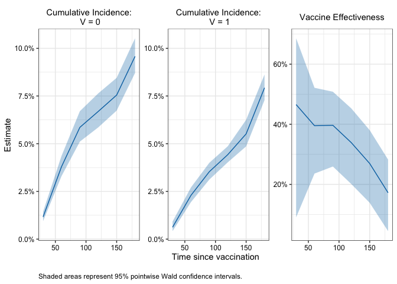
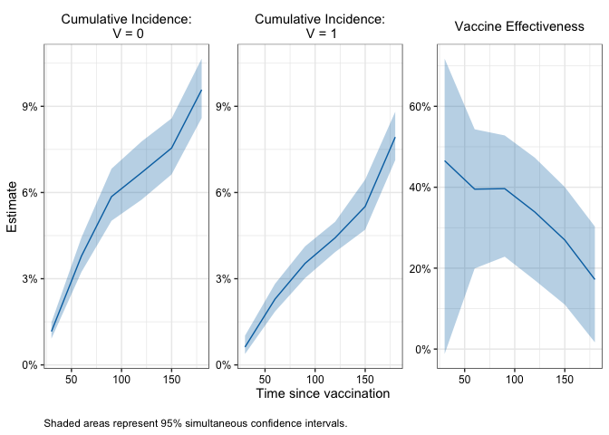
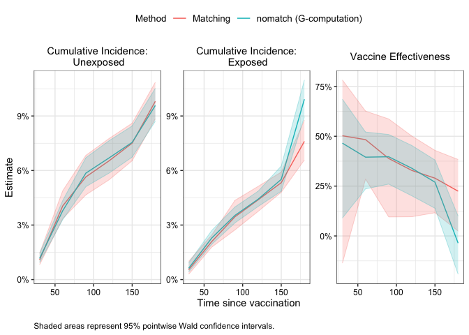

<!-- README.md is generated from README.Rmd. Please edit that file -->

# R/`nomatchVE`

> A matching alternative for more efficiently evaluating vaccine
> effectiveness using observational data

## Description

The `nomatchVE` package uses a G-computation style estimator to compute
vaccine effectiveness from observational vaccine studies. The proposed
estimator tends to produce similar point estimates as matching-based
estimators but can be more efficient.

## Installation

You can install the development version of `nomatchVE` with:

``` r
# install.packages("devtools")
devtools::install_github("ewu16/nomatchVE")
```

## Example

This minimal example shows how to use `nomatchVE` to obtain cumulative
incidence and vaccine effectiveness estimates in a simple simulated data
set.

``` r
#Load package
library(nomatchVE)

# Example data
head(simdata)
#>   ID x1 x2 V D_obs   Y event
#> 1  1  1  7 1     2  92     0
#> 2  2  0  7 0    NA 210     0
#> 3  3  0 11 1    35 210     0
#> 4  4  0 10 1     6 210     0
#> 5  5  1 11 0    NA 210     0
#> 6  6  1  7 0    NA  90     0
summary(simdata)
#>        ID              x1               x2               V         
#>  Min.   :    1   Min.   :0.0000   Min.   : 5.000   Min.   :0.0000  
#>  1st Qu.: 2501   1st Qu.:0.0000   1st Qu.: 6.000   1st Qu.:0.0000  
#>  Median : 5000   Median :0.0000   Median : 8.000   Median :0.0000  
#>  Mean   : 5000   Mean   :0.4989   Mean   : 8.023   Mean   :0.4112  
#>  3rd Qu.: 7500   3rd Qu.:1.0000   3rd Qu.:10.000   3rd Qu.:1.0000  
#>  Max.   :10000   Max.   :1.0000   Max.   :11.000   Max.   :1.0000  
#>                                                                    
#>      D_obs              Y           event       
#>  Min.   :  1.00   Min.   :  1   Min.   :0.0000  
#>  1st Qu.: 11.00   1st Qu.:174   1st Qu.:0.0000  
#>  Median : 18.00   Median :210   Median :0.0000  
#>  Mean   : 25.78   Mean   :178   Mean   :0.1007  
#>  3rd Qu.: 32.00   3rd Qu.:210   3rd Qu.:0.0000  
#>  Max.   :206.00   Max.   :210   Max.   :1.0000  
#>  NA's   :5888
```

``` r

# Compute cumulative incidence 
fit1 <- nomatchVE(data = simdata,
                  outcome_time = "Y",
                  outcome_status = "event",
                  exposure = "V",
                  exposure_time = "D_obs", 
                  covariates = c("x1", "x2"),
                  tau = 14,
                  eval_times = seq(30, 180, by = 30),
                  boot_reps = 10)
#> Bootstrapping 10 samples...
#> Time difference of 1.452928 secs

#Print results 
fit1        
#> 
#>  Vaccine Effectiveness Estimates 
#> ================================================== 
#> Call: nomatchVE(data = simdata, outcome_time = "Y", outcome_status = "event", 
#>     exposure = "V", exposure_time = "D_obs", covariates = c("x1", 
#>         "x2"), tau = 14, eval_times = seq(30, 180, by = 30), 
#>     boot_reps = 10) 
#> 
#> Result:
#>   Timepoint Estimate 95% Wald CI: Lower 95% Wald CI: Upper
#> 1        30    0.466             0.0902              0.686
#> 2        60    0.395             0.2359              0.521
#> 3        90    0.397             0.2594              0.508
#> 4       120    0.339             0.2011              0.453
#> 5       150    0.269             0.1387              0.380
#> 6       180    0.172             0.0444              0.283
#> 
#> Use summary() for more details
#> Use plot() to visualize results

#Summary 
summary(fit1)
#> 
#> ====================================================================== 
#> Vaccine Effectiveness Analysis Summary
#> ====================================================================== 
#> 
#> Method:              nomatchVE (G-computation) 
#> Evaluation times:    30, 60, 90, 120, 150, 180  
#> Tau (delay period):  14 
#> Adjusted for:        x1, x2 
#> 
#> Bootstrap:           10 replicates
#> Confidence level:    95 %
#> Successful samples:  10-10  (range across timepoints)
#> 
#> ---------------------------------------------------------------------- 
#> Sample:
#> ---------------------------------------------------------------------- 
#> N total: 10000 
#> Number of events: 1007 
#> 
#> N Exposed: 4112 
#> N Exposed at-risk <tau> days after exposure: 4045 
#> 
#> Distribution of exposure times among at-risk <tau> days after exposure:
#>  Range:  1 - 194 |  Median (IQR):  18 (11 - 32) |  Mean:  25.5
#> 
#> ---------------------------------------------------------------------- 
#> Model for unexposed:
#> ---------------------------------------------------------------------- 
#> N = 10000 | Number of events = 664 
#> 
#>      coef exp(coef) se(coef)      z Pr(>|z|)
#> x1  0.158     1.171    0.078  2.028    0.043
#> x2 -0.056     0.945    0.019 -2.906    0.004
#> 
#> ---------------------------------------------------------------------- 
#> Model for exposed:
#> ---------------------------------------------------------------------- 
#> N = 4045 | Number of events = 265 
#> 
#>                               coef exp(coef) se(coef)      z Pr(>|z|)
#> x1                           0.169     1.184    0.124  1.365    0.172
#> x2                          -0.089     0.915    0.031 -2.896    0.004
#> splines::ns(D_obs, df = 4)1  0.600     1.821    0.335  1.789    0.074
#> splines::ns(D_obs, df = 4)2  0.652     1.918    0.621  1.049    0.294
#> splines::ns(D_obs, df = 4)3 -0.422     0.656    1.127 -0.375    0.708
#> splines::ns(D_obs, df = 4)4 -0.906     0.404    2.117 -0.428    0.669
#> 
#> ======================================================================

#Plot pointwise intervals 
plot(fit1) 
```



``` r

#Compute simultaneous CI
fit1_with_simul <- add_simultaneous_ci(fit1, seed = 1234)

#Plot simultaneous confidence bands 
plot(fit1_with_simul , ci_type = "simul") 
```



``` r
# ------------------------------------------------------------------------------
# 3. Compare results with matching estimator


matched_cohort <- match_rolling_cohort(data = simdata,
                                       outcome_time = "Y",
                                       exposure = "V",
                                       exposure_time = "D_obs", 
                                       matching_vars = c("x1", "x2"),
                                       id_name = "ID",
                                       seed = 5678)

matched_data <- matched_cohort[[1]]


fit_matching <-matching_ve(matched_data = matched_data,
                           outcome_time = "Y",
                           outcome_status = "event",
                           exposure = "V",
                           exposure_time = "D_obs", 
                           tau = 14,
                           eval_times = seq(30, 180, by = 30),
                           boot_reps = 10) 
#> Bootstrapping 10 samples...
#> Time difference of 0.80884 secs

fit_matching
#> 
#>  Vaccine Effectiveness Estimates 
#> ================================================== 
#> Call: matching_ve(matched_data = matched_data, outcome_time = "Y", 
#>     outcome_status = "event", exposure = "V", exposure_time = "D_obs", 
#>     tau = 14, eval_times = seq(30, 180, by = 30), boot_reps = 10) 
#> 
#> Result:
#>   Timepoint Estimate 95% Wald CI: Lower 95% Wald CI: Upper
#> 1        30    0.503            -0.1366              0.782
#> 2        60    0.483             0.2854              0.626
#> 3        90    0.389             0.0954              0.587
#> 4       120    0.329             0.0963              0.501
#> 5       150    0.290             0.1163              0.429
#> 6       180    0.225             0.0245              0.384
#> 
#> Use summary() for more details
#> Use plot() to visualize results

## Plot matching vs proposed estimator - nomatch tends to have similar point estimates but narrower
# confidence intervals
compare_ve_fits(fit_matching, fit1, labels = c("Matching", "nomatch (G-computation)"))
```



## Issues

If you encounter any bugs or have any specific feature requests, please
[file an issue](https://github.com/ewu16/nomatchVE/issues).

## Citation

If you use the `nomatchVE` package in your work, please cite the
following:

     @Manual{,
       title = {nomatchVE: Estimate Causal Vaccine Effectiveness in Observational Studies
                 Without Matching},
       author = {Emily Wu},
       year = {2025},
       note = {R package version 0.0.0.9000, 
       https://github.com/ewu16/nomatchVE},
       url = {https://ewu16.github.io/nomatchVE/},
     }
